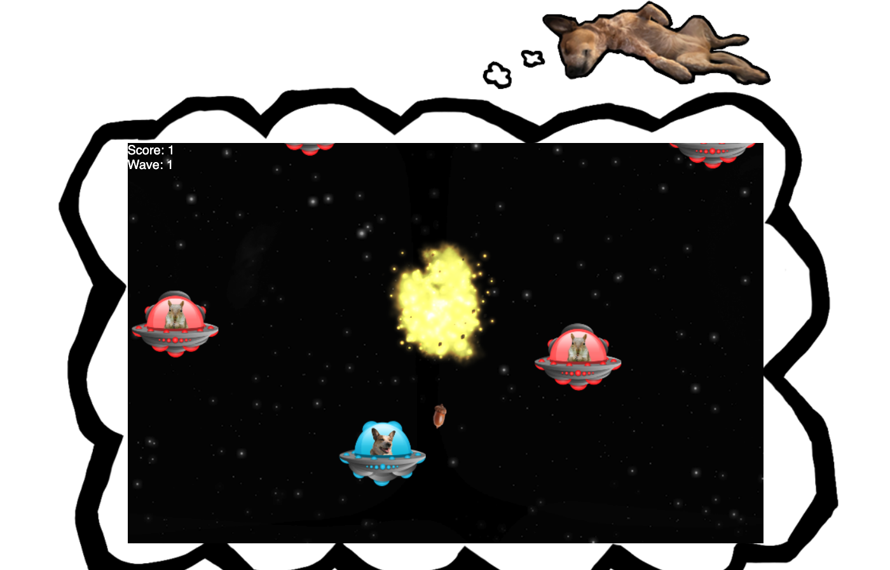

[front-end here](https://github.com/robotspacefish/invasion-frontend)

# Invasion!

A game about my dog Penny, dreaming of battling squirrels in space. Invasion was built with JavaScript on the frontend and Rails on the backend.



## Installation
Clone project

cd into invasion-backend
run
```
bundle install

#setup the db
rails db:create db:migrate

# if you want starter player data
rails db:seed

# start the server
rails s
```